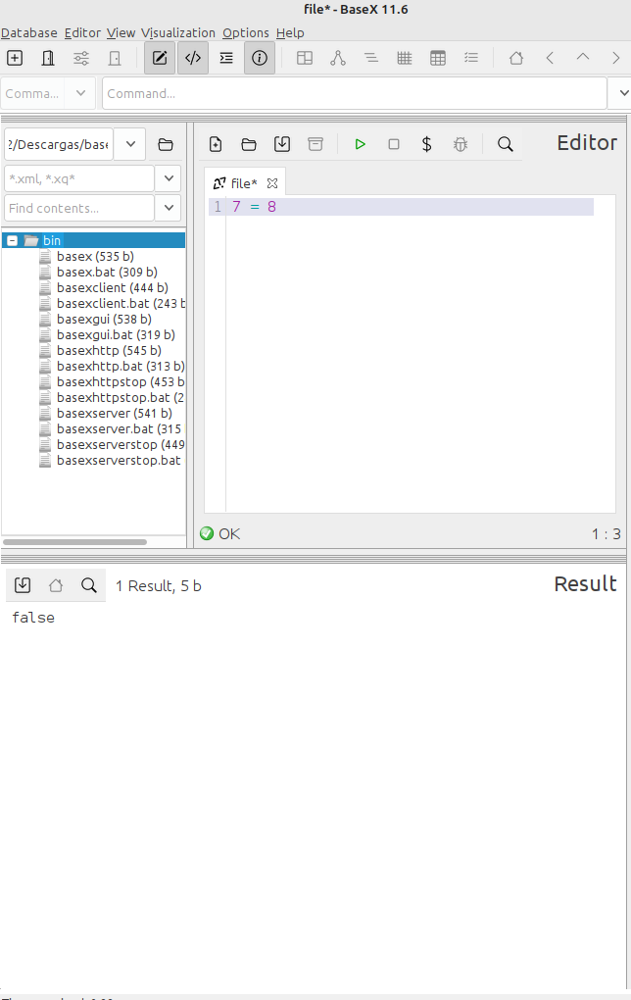
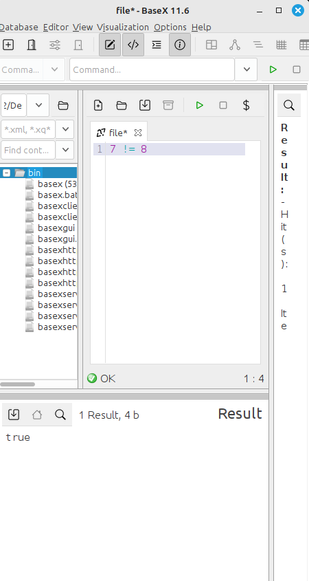
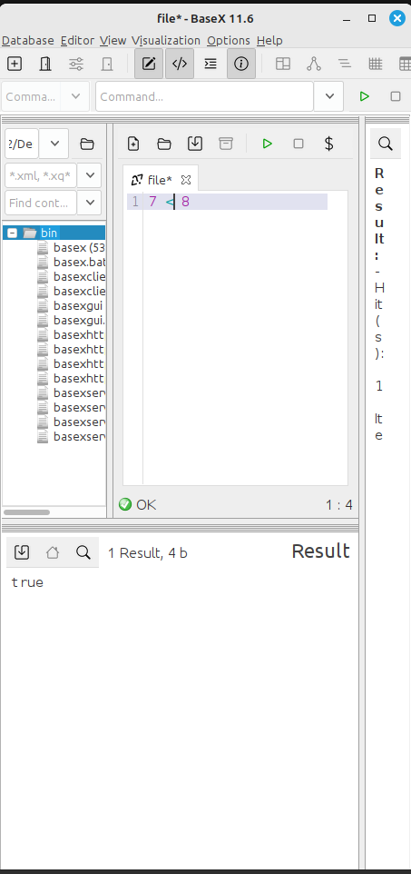
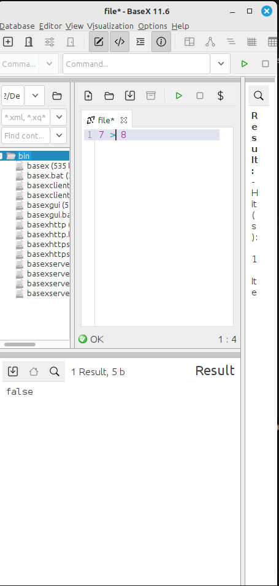
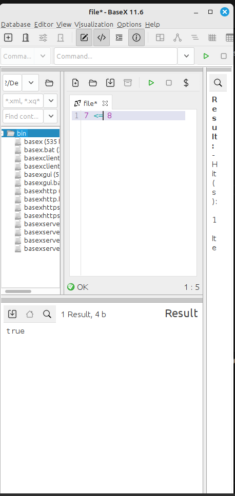

# Bienvenidos a mi repositorio 
## Realizado por Pablo Císcar Blázquez
## El tema: Comparadores
- Por forma totalmente aleatoria mi parte del trabajo consiste en:
    1. Explicacion teorica sobre el grupo de expreciones XQuery
    2. Ejemplo practico con codigo XQuery
    3. Captura de pantalla de la ejecucion del codigo en BaseX

## Teoría
Los comparadores en XQuery son operadores que permiten evaluar condiciones y comparar valores dentro de las consultas. XQuery, siendo un lenguaje diseñado para trabajar con datos estructurados como XML, ofrece una variedad de comparadores tanto para comparaciones numéricas como para comparaciones de otros tipos de datos. Aquí te explico más detalladamente los dos tipos principales de comparadores en XQuery y cómo se utilizan:
Comparadores Numéricos
### =: 
Estos comparadores son utilizados para realizar comparaciones entre valores numéricos:

    =: Igual que. Compara dos valores para verificar si son iguales.
    !=: No igual. Compara dos valores para verificar si no son iguales.
    <: Menor que. Verifica si el valor a la izquierda del operador es menor que el valor a la derecha.
    >: Mayor que. Verifica si el valor a la izquierda del operador es mayor que el valor a la derecha.
    <=: Menor o igual que. Verifica si el valor a la izquierda es menor o igual al valor a la derecha.
    >=: Mayor o igual que. Verifica si el valor a la izquierda es mayor o igual al valor a la derecha.

## Ejemplos
### =:  

### !=: 

### <: 

### >: 

### <=: 
